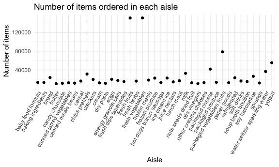
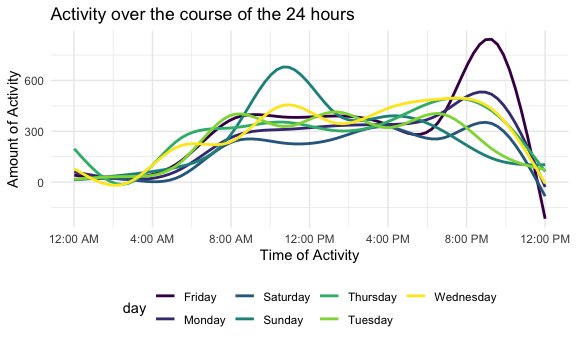
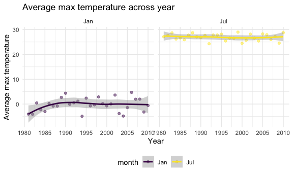
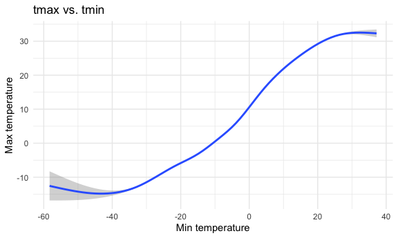
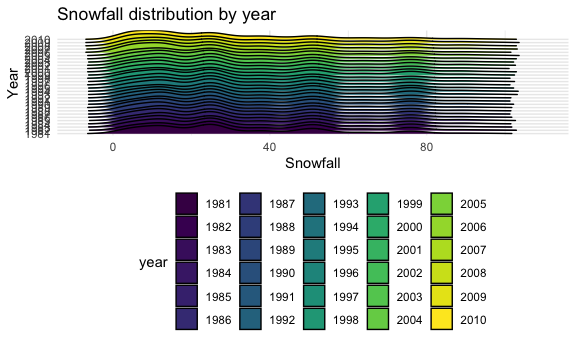

p8105_hw3_zq2209
================
Zining Qi
2022-10-12

``` r
library(tidyverse)
```

    ## ── Attaching packages ─────────────────────────────────────── tidyverse 1.3.2 ──
    ## ✔ ggplot2 3.3.6      ✔ purrr   0.3.4 
    ## ✔ tibble  3.1.8      ✔ dplyr   1.0.10
    ## ✔ tidyr   1.2.0      ✔ stringr 1.4.1 
    ## ✔ readr   2.1.2      ✔ forcats 0.5.2 
    ## ── Conflicts ────────────────────────────────────────── tidyverse_conflicts() ──
    ## ✖ dplyr::filter() masks stats::filter()
    ## ✖ dplyr::lag()    masks stats::lag()

``` r
library(ggridges)

knitr::opts_chunk$set(
  fig.width = 6,
  fig.asp = .6,
  out.width = "90%"
)

theme_set(theme_minimal() + theme(legend.position = "bottom"))

options(
  ggplot2.continuous.colour = "viridis",
  ggplot2.continuous.fill = "viridis"
)

scale_colour_discrete = scale_colour_viridis_d
scale_fill_discrete = scale_fill_viridis_d
```

# Problem 1

``` r
library(p8105.datasets)
data("instacart")
```

``` r
instacart = 
  instacart %>% 
  as_tibble(instacart)
```

``` r
# How many aisles are there, and which aisles are the most items ordered from?
instacart %>% 
  count(aisle) %>% 
  arrange(desc(n))
```

    ## # A tibble: 134 × 2
    ##    aisle                              n
    ##    <chr>                          <int>
    ##  1 fresh vegetables              150609
    ##  2 fresh fruits                  150473
    ##  3 packaged vegetables fruits     78493
    ##  4 yogurt                         55240
    ##  5 packaged cheese                41699
    ##  6 water seltzer sparkling water  36617
    ##  7 milk                           32644
    ##  8 chips pretzels                 31269
    ##  9 soy lactosefree                26240
    ## 10 bread                          23635
    ## # … with 124 more rows

``` r
# Make a plot that shows the number of items ordered in each aisle, limiting this to aisles with more than 10000 items ordered
instacart %>% 
  count(aisle) %>% 
  filter(n > 10000) %>% 
  ggplot(aes(x = aisle, y = n)) + 
  geom_point() + 
  labs(title = "Number of items ordered in each aisle") +
  theme(axis.text.x = element_text(angle = 60, hjust = 1))
```



``` r
# Make a table showing the three most popular items in each of the aisles “baking ingredients”, “dog food care”, and “packaged vegetables fruits”
instacart %>% 
  filter(aisle %in% c("baking ingredients", "dog food care", "packaged vegetables fruits")) %>%
  group_by(aisle) %>% 
  count(product_name) %>% 
  mutate(rank = min_rank(desc(n))) %>% 
  filter(rank < 4) %>% 
  arrange(desc(n)) %>%
  knitr::kable()
```

| aisle                      | product_name                                  |    n | rank |
|:---------------------------|:----------------------------------------------|-----:|-----:|
| packaged vegetables fruits | Organic Baby Spinach                          | 9784 |    1 |
| packaged vegetables fruits | Organic Raspberries                           | 5546 |    2 |
| packaged vegetables fruits | Organic Blueberries                           | 4966 |    3 |
| baking ingredients         | Light Brown Sugar                             |  499 |    1 |
| baking ingredients         | Pure Baking Soda                              |  387 |    2 |
| baking ingredients         | Cane Sugar                                    |  336 |    3 |
| dog food care              | Snack Sticks Chicken & Rice Recipe Dog Treats |   30 |    1 |
| dog food care              | Organix Chicken & Brown Rice Recipe           |   28 |    2 |
| dog food care              | Small Dog Biscuits                            |   26 |    3 |

``` r
# Make a table showing the mean hour of the day at which Pink Lady Apples and Coffee Ice Cream are ordered on each day of the week
instacart %>%
  filter(product_name %in% c("Pink Lady Apples", "Coffee Ice Cream")) %>%
  group_by(product_name, order_dow) %>%
  summarize(mean_hour = mean(order_hour_of_day)) %>% 
  pivot_wider(
    names_from = order_dow,
    values_from = mean_hour
  ) %>% 
  knitr::kable(digits = 2)
```

    ## `summarise()` has grouped output by 'product_name'. You can override using the
    ## `.groups` argument.

| product_name     |     0 |     1 |     2 |     3 |     4 |     5 |     6 |
|:-----------------|------:|------:|------:|------:|------:|------:|------:|
| Coffee Ice Cream | 13.77 | 14.32 | 15.38 | 15.32 | 15.22 | 12.26 | 13.83 |
| Pink Lady Apples | 13.44 | 11.36 | 11.70 | 14.25 | 11.55 | 12.78 | 11.94 |

# Problem 2

``` r
accel = read_csv("/Users/qizining/Desktop/p8105_hw3_zq2209/accel_data.csv")
```

    ## Rows: 35 Columns: 1443
    ## ── Column specification ────────────────────────────────────────────────────────
    ## Delimiter: ","
    ## chr    (1): day
    ## dbl (1442): week, day_id, activity.1, activity.2, activity.3, activity.4, ac...
    ## 
    ## ℹ Use `spec()` to retrieve the full column specification for this data.
    ## ℹ Specify the column types or set `show_col_types = FALSE` to quiet this message.

``` r
# Tidy
accel_data = accel %>% 
  janitor::clean_names() %>% 
  drop_na() %>% 
  mutate(Weekday_Weekend = ifelse(day %in% c("Saturday", "Sunday"), "Weekend", "Weekday")) %>% 
  pivot_longer(
    activity_1:activity_1440,
    names_to = "activity_time", 
    names_prefix = "activity_",
    values_to = "activity_amount")

nrow(accel_data)
```

    ## [1] 50400

``` r
ncol(accel_data)
```

    ## [1] 6

``` r
accel_data
```

    ## # A tibble: 50,400 × 6
    ##     week day_id day    Weekday_Weekend activity_time activity_amount
    ##    <dbl>  <dbl> <chr>  <chr>           <chr>                   <dbl>
    ##  1     1      1 Friday Weekday         1                        88.4
    ##  2     1      1 Friday Weekday         2                        82.2
    ##  3     1      1 Friday Weekday         3                        64.4
    ##  4     1      1 Friday Weekday         4                        70.0
    ##  5     1      1 Friday Weekday         5                        75.0
    ##  6     1      1 Friday Weekday         6                        66.3
    ##  7     1      1 Friday Weekday         7                        53.8
    ##  8     1      1 Friday Weekday         8                        47.8
    ##  9     1      1 Friday Weekday         9                        55.5
    ## 10     1      1 Friday Weekday         10                       43.0
    ## # … with 50,390 more rows

``` r
# total activity over the day
total_activity = accel_data %>% 
  group_by(week, day, day_id) %>% 
  summarize(total = sum(activity_amount)) %>% 
  knitr::kable()
```

    ## `summarise()` has grouped output by 'week', 'day'. You can override using the
    ## `.groups` argument.

``` r
total_activity
```

| week | day       | day_id |     total |
|-----:|:----------|-------:|----------:|
|    1 | Friday    |      1 | 480542.62 |
|    1 | Monday    |      2 |  78828.07 |
|    1 | Saturday  |      3 | 376254.00 |
|    1 | Sunday    |      4 | 631105.00 |
|    1 | Thursday  |      5 | 355923.64 |
|    1 | Tuesday   |      6 | 307094.24 |
|    1 | Wednesday |      7 | 340115.01 |
|    2 | Friday    |      8 | 568839.00 |
|    2 | Monday    |      9 | 295431.00 |
|    2 | Saturday  |     10 | 607175.00 |
|    2 | Sunday    |     11 | 422018.00 |
|    2 | Thursday  |     12 | 474048.00 |
|    2 | Tuesday   |     13 | 423245.00 |
|    2 | Wednesday |     14 | 440962.00 |
|    3 | Friday    |     15 | 467420.00 |
|    3 | Monday    |     16 | 685910.00 |
|    3 | Saturday  |     17 | 382928.00 |
|    3 | Sunday    |     18 | 467052.00 |
|    3 | Thursday  |     19 | 371230.00 |
|    3 | Tuesday   |     20 | 381507.00 |
|    3 | Wednesday |     21 | 468869.00 |
|    4 | Friday    |     22 | 154049.00 |
|    4 | Monday    |     23 | 409450.00 |
|    4 | Saturday  |     24 |   1440.00 |
|    4 | Sunday    |     25 | 260617.00 |
|    4 | Thursday  |     26 | 340291.00 |
|    4 | Tuesday   |     27 | 319568.00 |
|    4 | Wednesday |     28 | 434460.00 |
|    5 | Friday    |     29 | 620860.00 |
|    5 | Monday    |     30 | 389080.00 |
|    5 | Saturday  |     31 |   1440.00 |
|    5 | Sunday    |     32 | 138421.00 |
|    5 | Thursday  |     33 | 549658.00 |
|    5 | Tuesday   |     34 | 367824.00 |
|    5 | Wednesday |     35 | 445366.00 |

``` r
# activity over the course of the 24 hours
activity_of_day = accel_data %>% 
  mutate(activity_amount = round(activity_amount,0),
         activity_time = as.integer(activity_time)) %>% 
  ggplot(aes(x = activity_time, y = activity_amount, color = day)) +
  geom_smooth(se = FALSE) +
  scale_x_continuous(
    breaks = c(0, 240, 480, 720, 960, 1200, 1440),
    labels = c("12:00 AM", "4:00 AM", "8:00 AM", "12:00 PM", "4:00 PM", "8:00 PM", "12:00 PM")
  ) +
  labs(
    title = "Activity over the course of the 24 hours",
    x = "Time",
    y = "Activity Amount"
  )

activity_of_day
```

    ## `geom_smooth()` using method = 'gam' and formula 'y ~ s(x, bs = "cs")'



# Problem 3

``` r
library(p8105.datasets)
data("ny_noaa")
```

``` r
ny_noaa %>% 
  janitor::clean_names() %>% 
  summary()
```

    ##       id                 date                 prcp               snow       
    ##  Length:2595176     Min.   :1981-01-01   Min.   :    0.00   Min.   :  -13   
    ##  Class :character   1st Qu.:1988-11-29   1st Qu.:    0.00   1st Qu.:    0   
    ##  Mode  :character   Median :1997-01-21   Median :    0.00   Median :    0   
    ##                     Mean   :1997-01-01   Mean   :   29.82   Mean   :    5   
    ##                     3rd Qu.:2005-09-01   3rd Qu.:   23.00   3rd Qu.:    0   
    ##                     Max.   :2010-12-31   Max.   :22860.00   Max.   :10160   
    ##                                          NA's   :145838     NA's   :381221  
    ##       snwd            tmax               tmin          
    ##  Min.   :   0.0   Length:2595176     Length:2595176    
    ##  1st Qu.:   0.0   Class :character   Class :character  
    ##  Median :   0.0   Mode  :character   Mode  :character  
    ##  Mean   :  37.3                                        
    ##  3rd Qu.:   0.0                                        
    ##  Max.   :9195.0                                        
    ##  NA's   :591786

``` r
nrow(ny_noaa)
```

    ## [1] 2595176

``` r
ncol(ny_noaa)
```

    ## [1] 7

There are 2595176 rows and 7 columns. The dataset contains 7 variables,
which are id, date, prcp, snow, snwd(), tmax(), tmin(). prcp, snow, snwd
are measured in mm. tmax and tmin are measured in tenths of degrees. But
for prcp, snow, and snwd, there are many NA.

``` r
noaa = ny_noaa %>% 
  janitor::clean_names() %>% 
  separate(col = date, into = c("year", "month", "day"), sep = "-") %>% 
  mutate(tmax = as.numeric(tmax),
         tmin = as.numeric(tmin),
         year = as.numeric(year),
         month = as.numeric(month),
         day = as.numeric(day),
         month = month.abb[month],
         tmax = tmax / 10,
         tmin = tmin / 10,
         prcp = prcp / 10
         ) 

noaa  
```

    ## # A tibble: 2,595,176 × 9
    ##    id           year month   day  prcp  snow  snwd  tmax  tmin
    ##    <chr>       <dbl> <chr> <dbl> <dbl> <int> <int> <dbl> <dbl>
    ##  1 US1NYAB0001  2007 Nov       1    NA    NA    NA    NA    NA
    ##  2 US1NYAB0001  2007 Nov       2    NA    NA    NA    NA    NA
    ##  3 US1NYAB0001  2007 Nov       3    NA    NA    NA    NA    NA
    ##  4 US1NYAB0001  2007 Nov       4    NA    NA    NA    NA    NA
    ##  5 US1NYAB0001  2007 Nov       5    NA    NA    NA    NA    NA
    ##  6 US1NYAB0001  2007 Nov       6    NA    NA    NA    NA    NA
    ##  7 US1NYAB0001  2007 Nov       7    NA    NA    NA    NA    NA
    ##  8 US1NYAB0001  2007 Nov       8    NA    NA    NA    NA    NA
    ##  9 US1NYAB0001  2007 Nov       9    NA    NA    NA    NA    NA
    ## 10 US1NYAB0001  2007 Nov      10    NA    NA    NA    NA    NA
    ## # … with 2,595,166 more rows

``` r
most_observed_snow = noaa %>% 
  group_by(snow) %>% 
  drop_na() %>% 
  summarize(n_obs = n()) %>%
  arrange(desc(n_obs))

most_observed_snow
```

    ## # A tibble: 248 × 2
    ##     snow   n_obs
    ##    <int>   <int>
    ##  1     0 1112758
    ##  2    25   15809
    ##  3    13   12460
    ##  4    51    9252
    ##  5     5    5669
    ##  6     8    5380
    ##  7    76    5296
    ##  8     3    5276
    ##  9    38    5050
    ## 10   102    3386
    ## # … with 238 more rows

``` r
mean_tmax = noaa %>% 
  filter(month %in% c("Jan", "Jul")) %>% 
  group_by(year, month) %>% 
  summarize(mean_tmax = mean(tmax, na.rm = TRUE)) %>% 
  ggplot(aes(x = year, y = mean_tmax)) +
  geom_point(alpha = .5) +
  geom_smooth(se = TRUE) +
  facet_grid(. ~ month) +
  labs(title = "Average max temperature across year",
         x = "year",
         y = "Average max temperature")
```

    ## `summarise()` has grouped output by 'year'. You can override using the
    ## `.groups` argument.

``` r
mean_tmax
```

    ## `geom_smooth()` using method = 'loess' and formula 'y ~ x'



``` r
tmax_vs_tmin = noaa %>% 
  drop_na() %>% 
  ggplot(aes(x = tmin, y = tmax)) +
  geom_smooth() +
  labs(title = "tmax vs. tmin",
         x = "Min temperature",
         y = "Max temperature")

tmax_vs_tmin  
```

    ## `geom_smooth()` using method = 'gam' and formula 'y ~ s(x, bs = "cs")'



``` r
snowfall = noaa %>% 
  drop_na() %>% 
  filter(snow > 0) %>% 
  filter(snow < 100) %>% 
  mutate(year = as.factor(year)) %>% 
  ggplot(aes(x = snow, y = year, fill = year)) +
  geom_density_ridges(scale = 0.85) +
  labs(title = "Snowfall distribution by year",
         x = "Snowfall",
         y = "Year")
snowfall
```

    ## Picking joint bandwidth of 4.24


