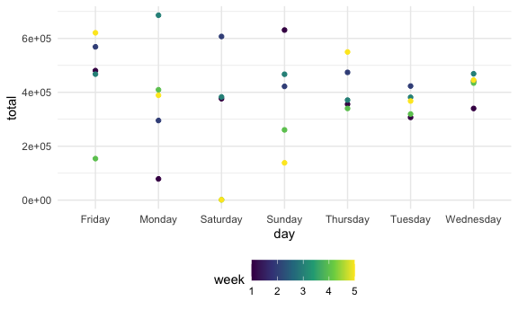
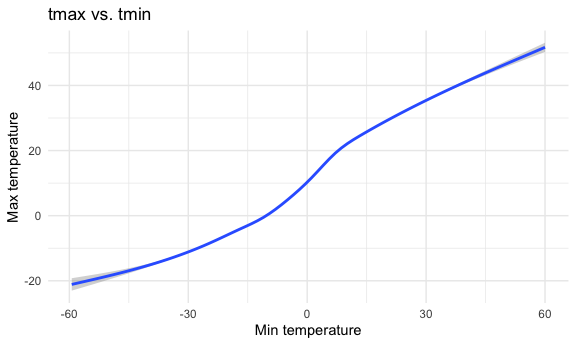
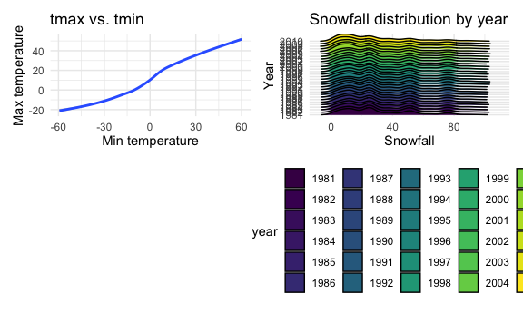

p8105_hw3_zq2209
================
Zining Qi
2022-10-12

``` r
library(tidyverse)
```

    ## ── Attaching packages ─────────────────────────────────────── tidyverse 1.3.2 ──
    ## ✔ ggplot2 3.3.6      ✔ purrr   0.3.4 
    ## ✔ tibble  3.1.8      ✔ dplyr   1.0.10
    ## ✔ tidyr   1.2.0      ✔ stringr 1.4.1 
    ## ✔ readr   2.1.2      ✔ forcats 0.5.2 
    ## ── Conflicts ────────────────────────────────────────── tidyverse_conflicts() ──
    ## ✖ dplyr::filter() masks stats::filter()
    ## ✖ dplyr::lag()    masks stats::lag()

``` r
library(ggridges)

knitr::opts_chunk$set(
  fig.width = 6,
  fig.asp = .6,
  out.width = "90%"
)

theme_set(theme_minimal() + theme(legend.position = "bottom"))

options(
  ggplot2.continuous.colour = "viridis",
  ggplot2.continuous.fill = "viridis"
)

scale_colour_discrete = scale_colour_viridis_d
scale_fill_discrete = scale_fill_viridis_d
```

# Problem 1

``` r
library(p8105.datasets)
data("instacart")
```

``` r
instacart = 
  instacart %>% 
  as_tibble(instacart)
```

``` r
# How many aisles are there, and which aisles are the most items ordered from?
instacart %>% 
  count(aisle) %>% 
  arrange(desc(n))
```

    ## # A tibble: 134 × 2
    ##    aisle                              n
    ##    <chr>                          <int>
    ##  1 fresh vegetables              150609
    ##  2 fresh fruits                  150473
    ##  3 packaged vegetables fruits     78493
    ##  4 yogurt                         55240
    ##  5 packaged cheese                41699
    ##  6 water seltzer sparkling water  36617
    ##  7 milk                           32644
    ##  8 chips pretzels                 31269
    ##  9 soy lactosefree                26240
    ## 10 bread                          23635
    ## # … with 124 more rows

``` r
# Make a plot that shows the number of items ordered in each aisle, limiting this to aisles with more than 10000 items ordered
instacart %>% 
  count(aisle) %>% 
  filter(n > 10000) %>% 
  ggplot(aes(x = aisle, y = n)) + 
  geom_point() + 
  labs(title = "Number of items ordered in each aisle",
       x = "Aisle",
       y = "Number of items") +
  theme(axis.text.x = element_text(angle = 60, hjust = 1))
```


``` r
# Make a table showing the three most popular items in each of the aisles “baking ingredients”, “dog food care”, and “packaged vegetables fruits”
instacart %>% 
  filter(aisle %in% c("baking ingredients", "dog food care", "packaged vegetables fruits")) %>%
  group_by(aisle) %>% 
  count(product_name) %>% 
  mutate(rank = min_rank(desc(n))) %>% 
  filter(rank < 4) %>% 
  arrange(desc(n)) %>%
  knitr::kable()
```

| aisle                      | product_name                                  |    n | rank |
|:---------------------------|:----------------------------------------------|-----:|-----:|
| packaged vegetables fruits | Organic Baby Spinach                          | 9784 |    1 |
| packaged vegetables fruits | Organic Raspberries                           | 5546 |    2 |
| packaged vegetables fruits | Organic Blueberries                           | 4966 |    3 |
| baking ingredients         | Light Brown Sugar                             |  499 |    1 |
| baking ingredients         | Pure Baking Soda                              |  387 |    2 |
| baking ingredients         | Cane Sugar                                    |  336 |    3 |
| dog food care              | Snack Sticks Chicken & Rice Recipe Dog Treats |   30 |    1 |
| dog food care              | Organix Chicken & Brown Rice Recipe           |   28 |    2 |
| dog food care              | Small Dog Biscuits                            |   26 |    3 |

``` r
# Make a table showing the mean hour of the day at which Pink Lady Apples and Coffee Ice Cream are ordered on each day of the week
instacart %>%
  filter(product_name %in% c("Pink Lady Apples", "Coffee Ice Cream")) %>%
  group_by(product_name, order_dow) %>%
  summarize(mean_hour = mean(order_hour_of_day)) %>% 
  pivot_wider(
    names_from = order_dow,
    values_from = mean_hour
  ) %>% 
  knitr::kable(digits = 2)
```

    ## `summarise()` has grouped output by 'product_name'. You can override using the
    ## `.groups` argument.

| product_name     |     0 |     1 |     2 |     3 |     4 |     5 |     6 |
|:-----------------|------:|------:|------:|------:|------:|------:|------:|
| Coffee Ice Cream | 13.77 | 14.32 | 15.38 | 15.32 | 15.22 | 12.26 | 13.83 |
| Pink Lady Apples | 13.44 | 11.36 | 11.70 | 14.25 | 11.55 | 12.78 | 11.94 |

# Problem 2

``` r
accel = read_csv("./dataset/accel_data.csv")
```

    ## Rows: 35 Columns: 1443
    ## ── Column specification ────────────────────────────────────────────────────────
    ## Delimiter: ","
    ## chr    (1): day
    ## dbl (1442): week, day_id, activity.1, activity.2, activity.3, activity.4, ac...
    ## 
    ## ℹ Use `spec()` to retrieve the full column specification for this data.
    ## ℹ Specify the column types or set `show_col_types = FALSE` to quiet this message.

``` r
# Cleaning, tidying, and wrangling data
accel_data = accel %>% 
  janitor::clean_names() %>% 
  drop_na() %>% 
  mutate(Weekday_Weekend = ifelse(day %in% c("Saturday", "Sunday"), "Weekend", "Weekday")) %>% 
  group_by(week, day_id) %>% 
  pivot_longer(
    activity_1:activity_1440,
    names_to = "activity_time", 
    names_prefix = "activity_",
    values_to = "activity_amount")

nrow(accel_data)
```

    ## [1] 50400

``` r
ncol(accel_data)
```

    ## [1] 6

``` r
accel_data
```

    ## # A tibble: 50,400 × 6
    ## # Groups:   week, day_id [35]
    ##     week day_id day    Weekday_Weekend activity_time activity_amount
    ##    <dbl>  <dbl> <chr>  <chr>           <chr>                   <dbl>
    ##  1     1      1 Friday Weekday         1                        88.4
    ##  2     1      1 Friday Weekday         2                        82.2
    ##  3     1      1 Friday Weekday         3                        64.4
    ##  4     1      1 Friday Weekday         4                        70.0
    ##  5     1      1 Friday Weekday         5                        75.0
    ##  6     1      1 Friday Weekday         6                        66.3
    ##  7     1      1 Friday Weekday         7                        53.8
    ##  8     1      1 Friday Weekday         8                        47.8
    ##  9     1      1 Friday Weekday         9                        55.5
    ## 10     1      1 Friday Weekday         10                       43.0
    ## # … with 50,390 more rows

After tidying,, cleaning and adding variables, there are 50400 rows, and
6 columns. The variables are week, day_id, day, weekday vs weekend,
activity time, and activity amount. Activity time is the minute if
activity in that day, and activity amount is the count of that activity
in that minute.Weekday vs Weekend is whether that day is weekday or
weekend.

``` r
# Total activity over the day
total_activity = accel_data %>% 
  group_by(week, day, day_id) %>% 
  summarize(total = sum(activity_amount)) %>% 
  knitr::kable()
```

    ## `summarise()` has grouped output by 'week', 'day'. You can override using the
    ## `.groups` argument.

``` r
total_activity
```

| week | day       | day_id |     total |
|-----:|:----------|-------:|----------:|
|    1 | Friday    |      1 | 480542.62 |
|    1 | Monday    |      2 |  78828.07 |
|    1 | Saturday  |      3 | 376254.00 |
|    1 | Sunday    |      4 | 631105.00 |
|    1 | Thursday  |      5 | 355923.64 |
|    1 | Tuesday   |      6 | 307094.24 |
|    1 | Wednesday |      7 | 340115.01 |
|    2 | Friday    |      8 | 568839.00 |
|    2 | Monday    |      9 | 295431.00 |
|    2 | Saturday  |     10 | 607175.00 |
|    2 | Sunday    |     11 | 422018.00 |
|    2 | Thursday  |     12 | 474048.00 |
|    2 | Tuesday   |     13 | 423245.00 |
|    2 | Wednesday |     14 | 440962.00 |
|    3 | Friday    |     15 | 467420.00 |
|    3 | Monday    |     16 | 685910.00 |
|    3 | Saturday  |     17 | 382928.00 |
|    3 | Sunday    |     18 | 467052.00 |
|    3 | Thursday  |     19 | 371230.00 |
|    3 | Tuesday   |     20 | 381507.00 |
|    3 | Wednesday |     21 | 468869.00 |
|    4 | Friday    |     22 | 154049.00 |
|    4 | Monday    |     23 | 409450.00 |
|    4 | Saturday  |     24 |   1440.00 |
|    4 | Sunday    |     25 | 260617.00 |
|    4 | Thursday  |     26 | 340291.00 |
|    4 | Tuesday   |     27 | 319568.00 |
|    4 | Wednesday |     28 | 434460.00 |
|    5 | Friday    |     29 | 620860.00 |
|    5 | Monday    |     30 | 389080.00 |
|    5 | Saturday  |     31 |   1440.00 |
|    5 | Sunday    |     32 | 138421.00 |
|    5 | Thursday  |     33 | 549658.00 |
|    5 | Tuesday   |     34 | 367824.00 |
|    5 | Wednesday |     35 | 445366.00 |

``` r
total_activity_plot = accel_data %>% 
  group_by(week, day, day_id) %>% 
  summarize(total = sum(activity_amount)) %>% 
  ggplot(aes(x = day, y = total, color = week)) +
  geom_point()
```

    ## `summarise()` has grouped output by 'week', 'day'. You can override using the
    ## `.groups` argument.

``` r
total_activity_plot
```



As shown in the plot, The total amount of activities in Friday, Monday,
Saturday, and Sunday are more spread. In Thursday, Tuesday, and
Wednesday, total activities are tighter. And in Saturday, it has lowest
activity amount.

``` r
# Activity over the course of the 24 hours
activity_of_day = accel_data %>% 
  mutate(activity_amount = round(activity_amount,0),
         activity_time = as.integer(activity_time)) %>% 
  ggplot(aes(x = activity_time, y = activity_amount, color = day)) +
  geom_smooth(se = FALSE) +
  scale_x_continuous(
    breaks = c(0, 240, 480, 720, 960, 1200, 1440),
    labels = c("12:00 AM", "4:00 AM", "8:00 AM", "12:00 PM", "4:00 PM", "8:00 PM", "12:00 PM")
  ) +
  labs(
    title = "Activity over the course of the 24 hours",
    x = "Time of Activity",
    y = "Amount of Activity"
  )

activity_of_day
```

    ## `geom_smooth()` using method = 'gam' and formula 'y ~ s(x, bs = "cs")'


According to the graph, activity amout during 12am to 4am is really low,
almost 0. And the amount start increasing from 4am. The amount from 8am
to 6pm are stay approximate consistent, except for Thursday. There is a
peak in 11am on Thursday. And from 8pm to 10pm, the activity amount
increase, especially on Friday, the amount is the highest. From 11pm, it
start decreasing.

# Problem 3

``` r
library(p8105.datasets)
data("ny_noaa")
```

``` r
ny_noaa %>% 
  janitor::clean_names() %>% 
  summary()
```

    ##       id                 date                 prcp               snow       
    ##  Length:2595176     Min.   :1981-01-01   Min.   :    0.00   Min.   :  -13   
    ##  Class :character   1st Qu.:1988-11-29   1st Qu.:    0.00   1st Qu.:    0   
    ##  Mode  :character   Median :1997-01-21   Median :    0.00   Median :    0   
    ##                     Mean   :1997-01-01   Mean   :   29.82   Mean   :    5   
    ##                     3rd Qu.:2005-09-01   3rd Qu.:   23.00   3rd Qu.:    0   
    ##                     Max.   :2010-12-31   Max.   :22860.00   Max.   :10160   
    ##                                          NA's   :145838     NA's   :381221  
    ##       snwd            tmax               tmin          
    ##  Min.   :   0.0   Length:2595176     Length:2595176    
    ##  1st Qu.:   0.0   Class :character   Class :character  
    ##  Median :   0.0   Mode  :character   Mode  :character  
    ##  Mean   :  37.3                                        
    ##  3rd Qu.:   0.0                                        
    ##  Max.   :9195.0                                        
    ##  NA's   :591786

``` r
nrow(ny_noaa)
```

    ## [1] 2595176

``` r
ncol(ny_noaa)
```

    ## [1] 7

There are 2595176 rows and 7 columns. The dataset contains 7 variables,
which are station id, date, prcp:Precipitation (tenths of mm),
snow:Snowfall (mm), snwd:Snow depth (mm), tmax:Maximum temperature
(tenths of degrees C), tmin:Minimum temperature (tenths of degrees C).
prcp, tmax, tmin are measured in tenth, so it will be divided by 10. But
for prcp, snow, and snwd, tmax, and tmin, there are many NA, shown in
summary table. NAs have to be dropped during calculation later.

``` r
# Do some data cleaning
noaa = ny_noaa %>% 
  janitor::clean_names() %>% 
  separate(col = date, into = c("year", "month", "day"), sep = "-") %>% 
  mutate(tmax = as.numeric(tmax),
         tmin = as.numeric(tmin),
         year = as.numeric(year),
         month = as.numeric(month),
         day = as.numeric(day),
         month = month.abb[month],
         tmax = tmax / 10,
         tmin = tmin / 10,
         prcp = prcp / 10
         ) %>% 
  select(year, month, day, everything())

noaa  
```

    ## # A tibble: 2,595,176 × 9
    ##     year month   day id           prcp  snow  snwd  tmax  tmin
    ##    <dbl> <chr> <dbl> <chr>       <dbl> <int> <int> <dbl> <dbl>
    ##  1  2007 Nov       1 US1NYAB0001    NA    NA    NA    NA    NA
    ##  2  2007 Nov       2 US1NYAB0001    NA    NA    NA    NA    NA
    ##  3  2007 Nov       3 US1NYAB0001    NA    NA    NA    NA    NA
    ##  4  2007 Nov       4 US1NYAB0001    NA    NA    NA    NA    NA
    ##  5  2007 Nov       5 US1NYAB0001    NA    NA    NA    NA    NA
    ##  6  2007 Nov       6 US1NYAB0001    NA    NA    NA    NA    NA
    ##  7  2007 Nov       7 US1NYAB0001    NA    NA    NA    NA    NA
    ##  8  2007 Nov       8 US1NYAB0001    NA    NA    NA    NA    NA
    ##  9  2007 Nov       9 US1NYAB0001    NA    NA    NA    NA    NA
    ## 10  2007 Nov      10 US1NYAB0001    NA    NA    NA    NA    NA
    ## # … with 2,595,166 more rows

Setting prcp, tmax, and tmin to standard unit, dividing by 10. Create
new variables of year, month, and day.

``` r
# The most commonly observed values for snowfall
most_observed_snow = noaa %>% 
  count(snow) %>% 
  arrange(desc(n))

most_observed_snow
```

    ## # A tibble: 282 × 2
    ##     snow       n
    ##    <int>   <int>
    ##  1     0 2008508
    ##  2    NA  381221
    ##  3    25   31022
    ##  4    13   23095
    ##  5    51   18274
    ##  6    76   10173
    ##  7     8    9962
    ##  8     5    9748
    ##  9    38    9197
    ## 10     3    8790
    ## # … with 272 more rows

The most common values are 0, NA, and 25. It make sense that most of
months don’t have snow. And NAs is a issue for snow.

``` r
# Average max temperature in January and in July in each station across years
mean_tmax = noaa %>% 
  filter(month %in% c("Jan", "Jul")) %>% 
  group_by(year, month) %>% 
  summarize(mean_tmax = mean(tmax, na.rm = TRUE)) %>% 
  ggplot(aes(x = year, y = mean_tmax, color = month)) +
  geom_point(alpha = .5) +
  geom_smooth(se = TRUE) +
  labs(title = "Average max temperature across year",
         x = "Year",
         y = "Average max temperature") +
  scale_x_continuous(
    breaks = c(1980, 1985, 1990, 1995, 2000, 2005, 2010)
    ) +
  facet_grid(. ~ month)
```

    ## `summarise()` has grouped output by 'year'. You can override using the
    ## `.groups` argument.

``` r
mean_tmax
```

    ## `geom_smooth()` using method = 'loess' and formula 'y ~ x'


By the plots, the most temperature lies around the line, which make
sense that within a month, the temperature don’t change dramatically. In
January, the temperatures approximately are between -5 and 5, some
points lies a little bit far from the line. In July, the average
temperatures are from 25 to 30, temperatures are more tight than
Jan. And there is no obvious outliers.

``` r
# The plot showing tmax vs tmin
tmax_vs_tmin = noaa %>% 
  drop_na() %>% 
  ggplot(aes(x = tmin, y = tmax)) +
  geom_smooth() +
  labs(title = "tmax vs. tmin",
         x = "Min temperature",
         y = "Max temperature")

tmax_vs_tmin  
```

    ## `geom_smooth()` using method = 'gam' and formula 'y ~ s(x, bs = "cs")'



From the plot, it is not linear, more likely a s shape. Max temperatures
are approximate from -15 to 35. And the min temperature are from -60 to
40.

``` r
# The plot showing snowfall values greater than 0 and less than 100 separately by year.
snowfall = noaa %>% 
  drop_na() %>% 
  filter(snow > 0, snow < 100) %>% 
  mutate(year = as.factor(year)) %>% 
  ggplot(aes(x = snow, y = year, fill = year)) +
  geom_density_ridges_gradient(scale = 3, rel_min_height = 0.01) +
  labs(title = "Snowfall distribution by year",
         x = "Snowfall",
         y = "Year") 
snowfall
```

    ## Picking joint bandwidth of 4.24


From the plot, the distributions are almost the same by years. And the
values from 0 to 40 are the most popular.

``` r
# Two-panel plot
library(patchwork)
tmax_vs_tmin + snowfall
```

    ## `geom_smooth()` using method = 'gam' and formula 'y ~ s(x, bs = "cs")'

    ## Picking joint bandwidth of 4.24



The left is the plot showing tmax vs tmin, and the right is plot showing
snowfall values greater than 0 and less than 100 separately by year.
